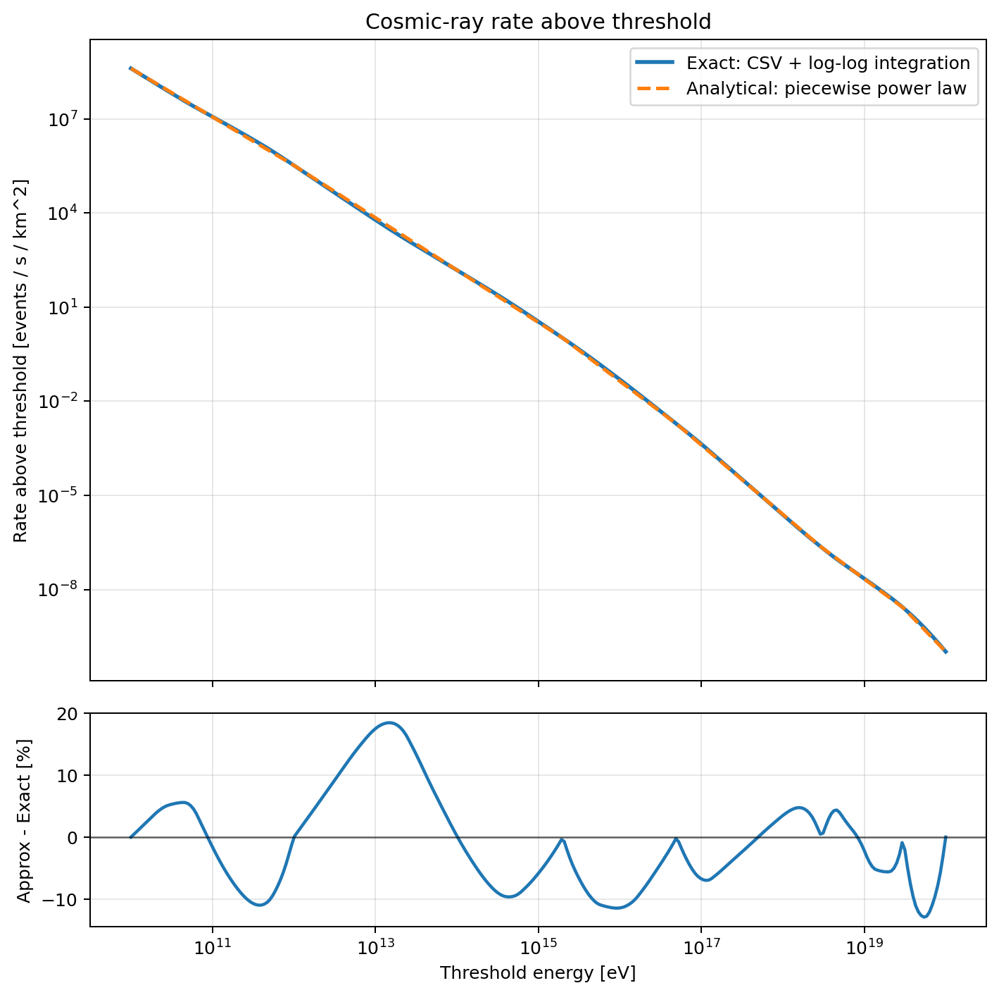

# Cosmic Ray Flux Threshold Rate

This folder contains a simple workflow to estimate the cosmic-ray event rate above an energy threshold using `data.csv`.

The numerical data in `data.csv` was scanned from the Wikipedia figure
"Cosmic ray flux versus particle energy". A local copy is included as
`Cosmic_ray_flux_versus_particle_energy.svg.png`, and the original source page is:
https://en.wikipedia.org/wiki/Cosmic_ray#/media/File:Cosmic_ray_flux_versus_particle_energy.svg

Files:

- `data.csv`: tabulated cosmic-ray differential flux versus energy.
- `cosmic_ray_rate.py`: exact interpolation-based integrator plus piecewise analytical approximation.
- `rate_comparison.png`: log-log comparison of exact vs analytical rate.
- `cosmic_ray_rate_formula.tex`: short LaTeX note with the analytical formula and a dense threshold table from `10^12` to `10^21 eV`.

<p>
  
</p>

## Units

The dataset is interpreted as:

- `E` in `eV`
- `F(E)` in `(m^2 sr s GeV)^-1`

The main quantity computed is the rate above threshold:

- `R(>E_th)` in `events / s / km^2`

for a flat horizontal `1 km^2` detector under an isotropic downward flux.

## Quick use

Compute the exact rate and compare with the analytical approximation:

```bash
python cosmic_ray_rate.py 1e15
```

Also print global approximation errors and regenerate the comparison plot:

```bash
python cosmic_ray_rate.py 1e15 --check-formula --plot rate_comparison.png
```

Use a different detector area:

```bash
python cosmic_ray_rate.py 1e18 --area-km2 5
```

## Notes

- The exact calculation uses log-log interpolation of the tabulated spectrum and analytic integration segment by segment.
- The analytical formula is a piecewise power-law fit to the exact threshold rate.
- The approximation is calibrated over roughly `10^10` to `10^20 eV`.
- Values beyond the top of the CSV range are extrapolations.
- The LaTeX table includes intermediate thresholds inside each decade for easier lookup.

## LaTeX

To build the formula note as a PDF:

```bash
pdflatex cosmic_ray_rate_formula.tex
```
