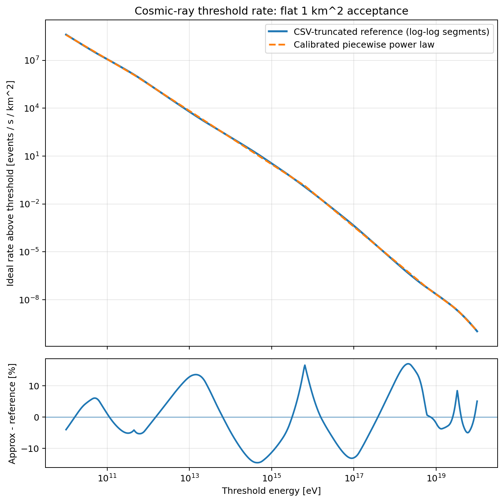

# Cosmic Ray Flux Threshold Rate

This project estimates an **ideal primary cosmic-ray crossing rate** above an incident-particle energy threshold from the tabulated spectrum in `data.csv`. It provides:

- a validated CSV loader and analytic integration of log-log power-law segments;
- an explicitly defined finite-range reference calculation;
- an optional, clearly labeled high-energy tail extrapolation;
- a continuous, five-piece power-law approximation calibrated to a selected dataset;
- reproducible tests, plot generation, and a LaTeX formula note.

The calculation is a geometric flux estimate, not a complete detector simulation. See [Scientific scope and limitations](#scientific-scope-and-limitations) and [DATA_PROVENANCE.md](DATA_PROVENANCE.md).

<p>
  
</p>

## Installation

Python 3.10 or newer is required.

```bash
python -m venv .venv
. .venv/bin/activate
python -m pip install -e .
```

On Windows (PowerShell), activate with:

```powershell
.venv\Scripts\Activate.ps1
```

Install optional plotting and test dependencies with:

```bash
python -m pip install -e ".[plot,test]"
```

The script also runs directly from a source checkout without installation.

## Quick use

Calculate the default CSV-truncated reference rate and, where applicable, the bundled piecewise approximation:

```bash
python cosmic_ray_rate.py 1e15
```

Typical output is deliberately limited to a modest number of significant figures:

```text
CSV-truncated reference rate: 3.47421 events / s
Piecewise approximation   : 3.08073 events / s
Sample-point relative error: 11.326 %
```

Use another ideal flat area:

```bash
python cosmic_ray_rate.py 1e18 --area-km2 5
```

Use a caller-supplied scalar aperture instead of the built-in angular conventions:

```bash
python cosmic_ray_rate.py 1e18 --aperture-m2-sr 3.1415927e6
```

This aperture is equivalent to the projected acceptance of an ideal one-sided, horizontal `1 km^2` surface under a downward isotropic intensity.

## The high-energy endpoint is explicit

The default calculation is **truncated at the largest energy in the CSV**:

```text
tail_model = truncate
```

It evaluates the finite integral from the threshold through `E_max`; it does not claim that the physical cosmic-ray flux is zero beyond `E_max`. A threshold above `E_max` is rejected, and the rate at exactly `E_max` is zero by the definition of this finite integral.

An optional model-dependent extrapolation extends only the final log-log segment to infinity:

```bash
python cosmic_ray_rate.py 1e20 --tail-model last-segment
```

This option is intentionally explicit because the inferred tail can dominate the result near the top of the table. The built-in analytical approximation is calibrated to the truncated convention, so another tail model requires explicit recalibration:

```bash
python cosmic_ray_rate.py 1e20 \
  --tail-model last-segment \
  --recalibrate-approximation
```

## Approximation checks

The default approximation has five power-law pieces from `10^10` through `10^20 eV`, tied to the bundled `data.csv` and the `truncate` tail convention. Its rounded breakpoints were selected against this reference. Calibration fits log-rates at each interval's endpoints and logarithmic quarter points, counting shared endpoints once. A small tridiagonal least-squares solve shares breakpoint rates between pieces to enforce continuity; rates need not equal the reference at the breakpoints. Fits that increase with energy are rejected.

Print sampled error statistics and regenerate the comparison plot:

```bash
python cosmic_ray_rate.py 1e15 \
  --check-formula \
  --plot rate_comparison.png
```

The five-piece fit has about 5.33% median, 14.58% 95th-percentile, and 17.03% worst sampled error relative to the CSV integral. The previous six-piece fit had 5.43%, 16.06%, and 18.44%, respectively, over the same range. Individual thresholds can still have larger errors than before. Prefer the reference calculation for numerical work; the fit is a compact formula for hand estimates. These errors measure the shortcut's accuracy, not physical uncertainty in the spectrum.

Checks and plots span the selected approximation's calibration range, with thresholds uniformly spaced in `log10(E)`. The statistics are not mathematical global bounds. The default check uses 10,001 thresholds; this can be changed with `--check-points`.

A custom CSV is never silently compared with coefficients calibrated to different data. Recalibrate explicitly:

```bash
python cosmic_ray_rate.py 1e15 \
  --csv another_spectrum.csv \
  --recalibrate-approximation \
  --check-formula
```

If the dataset does not span the built-in break points, recalibration restricts them to the dataset's energy range and prints a note. Explicit break energies can be supplied instead:

```bash
python cosmic_ray_rate.py 1e13 \
  --csv narrow_spectrum.csv \
  --recalibrate-approximation \
  --approx-breaks-ev 1e12,1e14,1e16
```

## CSV schema

Comment lines beginning with `#` and blank lines are ignored. The first remaining line must be exactly:

```csv
energy_eV,flux_per_m2_sr_s_GeV
```

Every data row must contain two finite, strictly positive numeric values in plain ASCII decimal or scientific notation (for example `1.5e12`). A leading UTF-8 byte-order mark is tolerated. Rows may appear in any order; they are sorted by energy. Duplicate energies are rejected.

The interpreted units are:

- `energy_eV`: eV;
- `flux_per_m2_sr_s_GeV`: `(m^2 sr s GeV)^-1`.

## Angular and detector assumptions

For `--geometry flat`, the rate uses the projected factor `pi * A` for an ideal one-sided horizontal surface exposed to an isotropic downward intensity. This follows from integrating `cos(theta) dOmega` over the downward hemisphere. For an area in km² and energy in eV, the rate in events/s is `pi * area_km2 * 1e-3 * integral F(E) dE`: the factor combines `1e6 m²/km²` with `1e-9 GeV/eV`.

The `hemisphere` and `full_sky` choices instead treat the supplied area as direction-independent and integrate it over `2*pi` or `4*pi sr`. They are effective-aperture conventions and are **not** the projected geometry of an ordinary flat detector.

The project does not model detector efficiency, dead time, trigger/reconstruction thresholds, atmospheric shower response, site effects, or an energy- and direction-dependent effective area. For an actual instrument, integrate the spectrum against the instrument response rather than treating this scalar rate as a predicted event yield.

## Scientific scope and limitations

`data.csv` was digitized from the included plot `Cosmic_ray_flux_versus_particle_energy.svg.png`. The original archive did not include a digitization script, source coordinates, point uncertainties, or a primary experimental table. The many stored decimal places are digitizer output and must not be interpreted as measurement precision.

The [source graphic](https://commons.wikimedia.org/wiki/File:Cosmic_ray_flux_versus_particle_energy.svg) describes incident cosmic rays at the top of the atmosphere. This is not a ground-level muon, radiation-dose, or deposited-energy model. Its energy axis does not specify kinetic versus total particle energy, and it supplies no species breakdown. The code uses the plotted particle-energy coordinate; it cannot convert an energy-per-nucleon or rigidity spectrum without additional composition data. The distinction between these variables is discussed in the [PDG cosmic-ray review, section 30.1](https://pdg.lbl.gov/2025/reviews/rpp2025-rev-cosmic-rays.pdf).

Low-energy results depend on solar modulation and geomagnetic cutoffs; the bundled curve has no site or epoch specification. An isotropic, site-independent calculation is therefore only an illustrative convention, especially below about 10 GeV. See [PDG 2022, section 30.1](https://pdgaws.lbl.gov/2022/reviews/rpp2022-rev-cosmic-rays.pdf).

The phrase **CSV-truncated reference** is used instead of “exact.” The segment integrals are analytic for the chosen log-log interpolation, but the underlying plotted spectrum and the unknown high-energy tail remain approximate.

For research or publication, replace the digitized plot values with a cited primary dataset that includes uncertainties and document any detector response model.

## Reproducibility

Run the automated tests:

```bash
python -m pytest
```

Regenerate the LaTeX fragments and comparison plot:

```bash
python generate_artifacts.py
```

Build the PDF note, when `pdflatex` is installed:

```bash
make pdf
```

`make pdf` regenerates only the LaTeX fragments and needs no Matplotlib; `make generate` additionally rebuilds `rate_comparison.png` and requires the `plot` extra.

Or run the standard targets:

```bash
make test
make artifacts
```

`generate_artifacts.py` derives the approximation rates and exponents from the selected reference implementation, so the Python code, plot, validation statistics, and LaTeX tables do not require separately maintained numeric constants.

## Project files

- `cosmic_ray_rate.py`: validated loader, integration, acceptance helpers, approximation, plotting, and CLI.
- `data.csv`: digitized differential spectrum using the documented schema.
- `DATA_PROVENANCE.md`: source history, attribution, and data limitations.
- `NOTICE`: concise third-party attribution and the selected source-image license.
- `generate_artifacts.py`: regenerates approximation/table fragments and `rate_comparison.png`.
- `cosmic_ray_rate_formula.tex`: formula note that includes the generated fragments.
- `generated_approximation.tex`, `generated_rate_table.tex`: `\input{}` fragments regenerated by `generate_artifacts.py`.
- `Makefile`: `make test`, `make generate`, `make fragments`, `make pdf`, `make artifacts` targets.
- `tests/`: analytic power laws, rate derivatives, endpoints, custom-data, and CLI tests.
- `pyproject.toml`: Python version, optional dependencies, command entry point, and test configuration.

## License status

The original archive did not specify a software license. The included `LICENSE` file makes that status explicit rather than granting rights on behalf of unknown copyright holders. The source image and copyrightable adaptations use the attribution and CC BY-SA 3.0 terms recorded in `DATA_PROVENANCE.md`.
